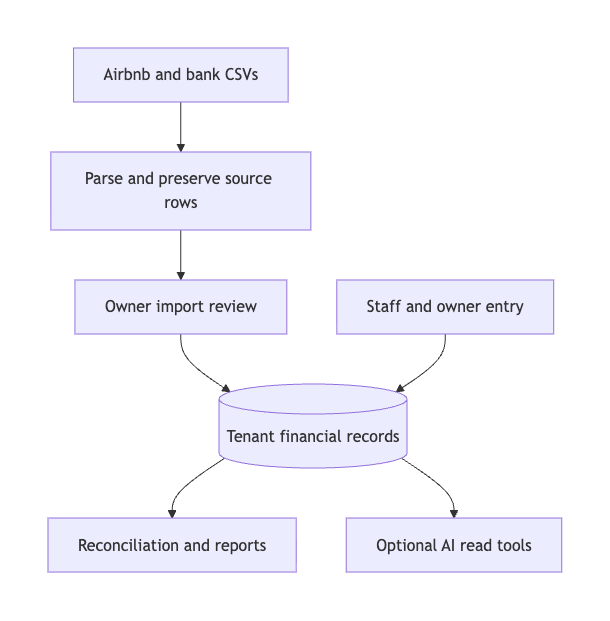

# LedgerKey

**Financial operations for short-term rental owners: trace income, allocate shared expenses, and reconcile platform payouts against bank deposits.**

[Architecture](docs/architecture.md) · [Validation](docs/validation.md) · [View code](examples/allocation.ts) · [Product walkthrough](docs/walkthrough.md) · [Engineering workflow](docs/engineering-workflow.md)

Rental finances rarely fit one spreadsheet row: a booking can have fees, withholding, and adjustments; a bank deposit can cover several payouts; a shared expense affects several units. LedgerKey helps owners see unit profitability and explain where the money went. Staff capture expenses and receipts; owners review imports, reconcile deposits, and export financial facts for an accountant.

## Engineering highlights

- **Separate the financial facts.** Bookings, financial lines, payouts, and bank transactions have distinct identities. Matching supports grouped money movements rather than assuming one booking equals one deposit.
- **Make imports reviewable and recoverable.** Preserve raw rows and parser versions, surface duplicates and unknown types, then commit approved Airbnb imports through a transaction that couples status changes with ledger rollup.
- **Conserve every paise.** Store money in minor units and distribute shared-cost rounding remainders deterministically. The public example contains the actual allocation functions.
- **Keep AI inside a defined boundary.** Owner-only tools read through the caller’s authorization context, return predefined metrics, and recheck access before each dispatch. Export requests require a user confirmation; the model does not write the ledger.
- **Test the seams.** Client/server metric parity fixtures, permission tests, import regressions, and browser journeys address errors that isolated arithmetic tests miss.

The engineering contribution spans the React interface, PostgreSQL schema and RPCs, import/reconciliation logic, deterministic reporting, and AI tool integration. Development uses an explicit specification, AI-assisted implementation, automated checks, and human smoke testing. [See the workflow and a failure-driven design change](docs/engineering-workflow.md).

## Verified evidence

| Area | Evidence and scope |
|---|---|
| Application tests | **306/306 passed**, across **39 test files**, in the reviewed local source state |
| Static checks | TypeScript/Vite build passed; ESLint had **0 errors, 4 warnings** |
| AI surface | **15 registered business tools**; a separate refusal marker supports evaluation |
| Metric contract | **13 predefined metrics**, with a shared fixture for client/SQL parity |
| Public example | **6/6 tests passed**, using synthetic inputs and the production allocation excerpt |

These are engineering checks, not adoption, financial-impact, or model-accuracy measurements. Database, live-model, and product browser suites were not rerun for this publication. [Methods, dates, and limitations](docs/validation.md) · [Aggregate evidence](evidence/metrics.json)

## How it works

[Diagram source](assets/overview.mmd)

All reads and writes cross authorization checks; the simplified arrows above show data flow. [Detailed import and AI boundaries](docs/architecture.md).

## A decision you can run

Split a synthetic **₹100.01** shared expense equally across three units. Rounding each share independently loses money. Instead, divide the integer paise, then assign the remainder in a stable order.

| Synthetic unit | Equal split | 50% / 30% / 20% split |
|---|---:|---:|
| Unit A | ₹33.34 | ₹50.01 |
| Unit B | ₹33.34 | ₹30.00 |
| Unit C | ₹33.33 | ₹20.00 |
| **Total** | **₹100.01** | **₹100.01** |

**[View production code](examples/allocation.ts)** · [Run the demo](examples/README.md) · [Inspect tests](examples/allocation.test.mjs)

Percentage splits use largest remainders; ties preserve allocation-row order. Ordering is part of the contract, so the SQL and browser implementations must agree on both amounts and ordering.

## Product workflows

- **Staff:** capture a unit expense, attach a receipt, and track reimbursements within assigned-unit access.
- **Owners:** review CSV imports, inspect expected versus received payouts, confirm fuzzy proposals, review allocations and settlement, then export CSV reports.
- **Optional AI:** ask about supported financial facts, inspect tool citations, and confirm a prepared export in the interface.

[Walk through a synthetic month-end scenario](docs/walkthrough.md). No live demo or product screenshots are included.

## Technology

- **Interface:** React, TypeScript, Vite, Tailwind CSS, Radix/shadcn components.
- **Data and access:** Supabase Auth, PostgreSQL, row-level security, Storage, SQL RPCs.
- **Server integrations:** Supabase Edge Functions, Anthropic API for optional AI, Telegram notifications.
- **Verification:** Vitest, ESLint, TypeScript, Playwright, SQL access and parity tests.

## Scope and access

This public repository contains newly written documentation, aggregate evidence, synthetic example inputs, and two selected production functions. The full application, financial records, receipts, raw imports, operational logs, credentials, and original Git history remain private. No open-source license is granted.

Implemented capabilities are separated from deferred work in the [architecture status table](docs/architecture.md#implementation-status). Receipt OCR, vendor CSV expense import, and dedicated PDF export were considered and deferred; their design notes are not measured experiments or shipped features.
