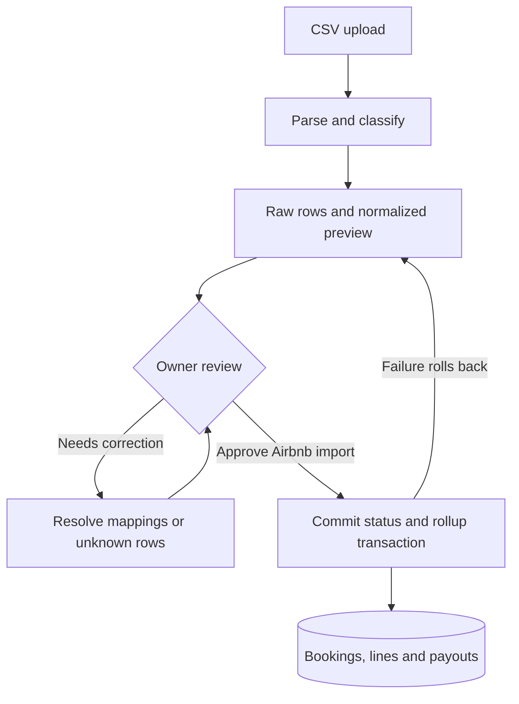
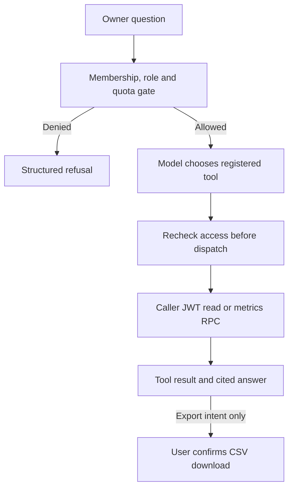

# Architecture

[← Project overview](../README.md) · [Validation](validation.md) · [Walkthrough](walkthrough.md)

## Responsibilities and deployment boundaries

The React/Vite application handles forms, CSV parsing and review, deterministic report presentation, and client-side CSV exports. Supabase provides authentication, PostgreSQL tables and transactional RPCs, private file storage, and Edge Functions. Tenant-scoped records carry `tenant_id`; active membership and role checks constrain access. Staff workflows additionally use unit assignments and own-record rules.

The optional AI Edge Function calls the Anthropic API server-side. Business tools query under the caller’s JWT rather than a privileged service identity. Model credentials stay on the server. Telegram delivery is another server integration; it uses recipient-linked notification records rather than an arbitrary client-supplied destination.

The project documents Vercel as the intended frontend host. No live frontend deployment or public demo endpoint was verified for this showcase. A successful local build is not evidence of production deployment.

## Import boundary

Raw files and source rows are retained separately from normalized financial records. Hashes support duplicate detection; parser versions support traceability. Listing labels are not treated as stable property identifiers. Unknown transaction types remain visible for review. Payout allocations are not inferred from adjacent CSV rows.

The commit transaction above is specifically the implemented Airbnb path. Bank imports follow their own review and normalization path into bank transactions. Reconciliation joins expected payouts to deposits using deterministic matches, fuzzy proposals, or manual matches; a fuzzy proposal requires owner confirmation. Non-rental bank entries do not all become missing-payout alerts.

**Why atomic commit matters:** an earlier UI path changed import status without running ledger rollup. The current RPC performs both in one transaction and allows an idempotent recovery call on already-committed ingestions. An exception rolls the transaction back. This turns a discovered integration failure into an explicit invariant.

## Optional AI boundary

The standard reports and exports work without AI. No AI step sits on the import commit path. The tool registry defines supported parameters and role availability; the model does not generate SQL or mutate ledger records. An export tool returns an intent, and the client fetches authorized data and uses the existing report exporter after confirmation.

The metrics contract defines 13 metrics and supported grouping dimensions. Invalid requests return steering errors instead of misleading empty data. Permission failures are distinguished from a legitimate zero result. Client and SQL computations share expected-fixture values; this is a parity method on finite fixtures, not a proof for every possible ledger.

## Financial decisions

- **Minor units:** money is stored as integer paise. Equal allocation and custom-percentage allocation preserve the total; the latter uses largest remainders. [View the exact functions](../examples/allocation.ts).
- **Source semantics:** the imported Airbnb gross value already includes its cleaning-fee breakdown. Adding both again would double-count revenue. Platform fees and withholding deduct by magnitude; Airbnb-remitted guest tax remains a distinct source fact.
- **Many-to-many matching:** booking identity, payout identity, and bank-credit identity are independent. Proposed matches carry explanations and review state.
- **Time and reporting:** timestamps use UTC, while named reporting periods resolve in the tenant timezone. Dashboard overlapping-booking semantics and report-specific period anchors are explicit; monthly buckets should not be assumed additive without checking that contract.
- **Auditability:** financial mutation paths have audit records, with sensitive fields redacted or represented by references. Mutable ledger records use soft deletion; source history is preserved.

## Failure handling and observability

Import review exposes unknown rows and mapping issues before approval. Transactional commit prevents a partially committed Airbnb ledger. AI access is rechecked for each dispatch; tool errors carry structured codes and guidance, and the model loop is bounded. Some AI aggregations cap reads at 5,000 rows and report truncation. This is a known limit, not a scalability benchmark.

AI query logging records tool usage, timing, token usage, and denials with parameter redaction. Audit history and source-row lineage explain financial changes. Telegram delivery reports failures; a failure after sending but before marking delivery can make a retry duplicate the message. These mechanisms support investigation, not autonomous remediation or automatic model retraining.

## Implementation status

| Status | Capability |
|---|---|
| Implemented in reviewed source | Expense/receipt capture, direct bookings, Airbnb and ICICI CSV review, shared allocations, payout matching, reports and CSV export |
| Implemented in reviewed source | Owner/staff authorization, audit history, in-app notifications and Telegram integration |
| Implemented in reviewed source | Owner AI chat, 15 business tools, metrics contract, export confirmation; settlement AI tool is a preview |
| Incomplete | Additional co-host payout-report stream; awaiting an observed export format |
| Evaluated as a design decision, deferred | Receipt OCR, vendor CSV expense import, dedicated PDF export |
| Future scope | Expanded investor/co-host roles and analytics; reconciliation/close/insight AI tool families |

“Implemented” describes inspected code, not a claim that all paths were deployed or freshly end-to-end tested. [See validation boundaries](validation.md).
